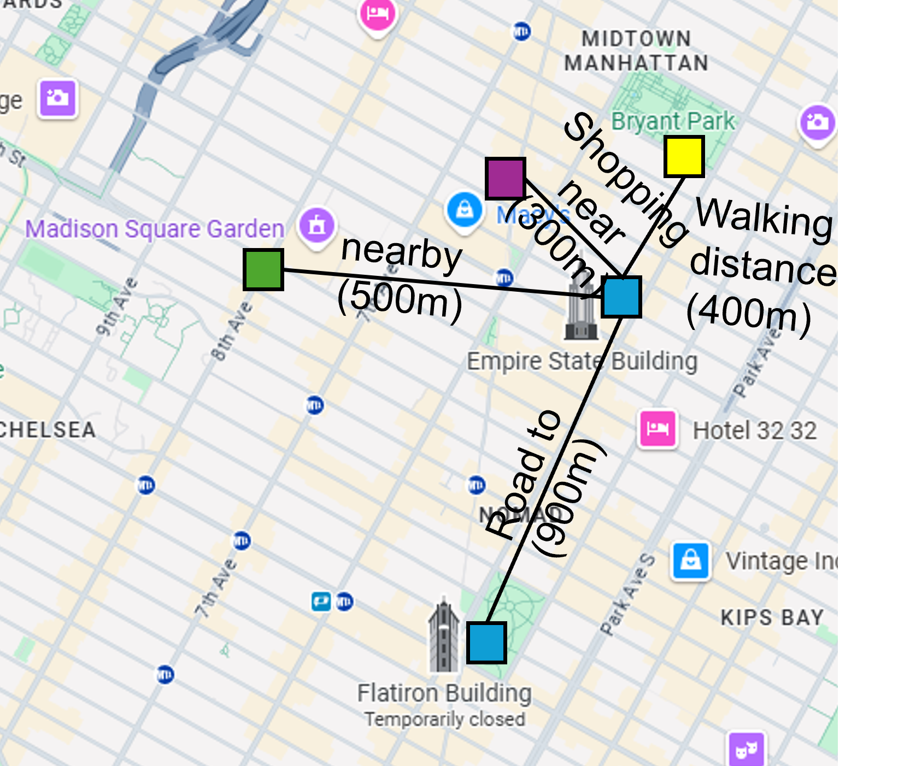

# Knowledge-graphs
# Introduction to Knowledge Graphs

## 1. What is a Graph?

A **graph** is a mathematical structure consisting of:

- **Nodes (vertices):** represent entities such as people, places, or objects.  
- **Edges (links):** represent relationships or connections between entities.

Graphs can be:
- **Undirected:** no direction (e.g., Facebook friendship).  
- **Directed:** edges point one way (e.g., Twitter follow).  
- **Weighted:** edges carry values like distance, cost, or importance.

**Example:**
- People as nodes: Alice, Bob, Charlie  
- Friendships as edges: Alice ↔ Bob, Bob ↔ Charlie  
- If we add distance (e.g., Alice–Bob = 2 mi), it becomes a weighted graph.

---

## 2. From Graphs to Knowledge Graphs

A **knowledge graph** goes beyond connections by adding **semantics** (meaning).

- Nodes have attributes (e.g., Macy’s = Shopping, Bryant Park = Park).  
- Edges describe the relationship (e.g., *shopping_near*, *walking_distance*) and may also have numerical values.  

This makes the graph rich in information and enables reasoning, queries, and AI models to extract insights.

**Example:**
- Node: “Einstein” → attributes: Scientist, Human  
- Edge: Einstein → Nobel Prize → `won`  

This is more than a connection; it encodes knowledge.

---

## 3. City Map as a Knowledge Graph

Real-world data can be represented as graphs.  
Here we use part of New York City:

- **Nodes (landmarks):**
  - Empire State Building (Historic)  
  - Macy’s (Shopping)  
  - Madison Square Garden (Entertainment)  
  - Bryant Park (Park)  
  - Flatiron Building (Historic)  

- **Edges (relationships + distances):**
  - Empire State → Macy’s: `shopping_near (300m)`  
  - Empire State → Madison Square Garden: `nearby (500m)`  
  - Empire State → Bryant Park: `walking_distance (400m)`  
  - Empire State → Flatiron Building: `road_to (900m)`  

📷 **Figure:** Annotated city map (nodes and edges)  


This single example shows:
- **Graph:** landmarks + roads  
- **Knowledge Graph:** add meaning + distances  
- **GNN Input:** node categories + edge weights  

---

## 4. Why Do We Need Knowledge Graphs?

Knowledge graphs let us **model complex relationships** intuitively and apply them to real problems.

- **Social Networks:**  
  - Facebook: undirected friendships  
  - Twitter: directed follows  

- **Transport Networks:**  
  - Subway stations as nodes, tracks as edges  
  - Finding the **most central station** (betweenness centrality) tells us which hub is most critical.  

- **Sales Forecasting:**  
  - Standard ML (e.g., Gradient Boosting) uses tabular features.  
  - Knowledge graphs add relational features:
    - Nodes: Accounts, Regions, Reps, Products  
    - Edges: `handles(Rep→Account)`, `sells_in(Rep→Region)`  
  - Adding centrality or community information improves predictions.  

**In short:**  
Graphs allow **structure**.  
Knowledge graphs allow **reasoning**.  
GNNs allow **learning from relationships**.

---

## 5. Analysis on Graphs

Once a graph is built, we can run many useful analyses:

- **Centrality:** Find influential nodes (e.g., critical subway hub, key sales account).  
- **Shortest Path:** Optimize routes (e.g., shortest tourist walk between landmarks).  
- **Community Detection:** Find clusters (e.g., product categories, friend groups).  
- **Recommendation:** Suggest next nodes (e.g., recommend a product based on connected purchases).  

---

## 6. How Graphs are Represented in Computers

Two common formats:

- **Adjacency Matrix:** square grid of 0/1 or weights (simple but memory-heavy).  
- **Adjacency List:** dictionary of connections (efficient for sparse graphs, most real-world cases).  

**Example (Adjacency List for city graph on a small scale):**
```python
graph = {
  "Empire State": ["Macy's", "Madison Square Garden", "Bryant Park", "Flatiron Building"],
  "Macy's": [],
  "Madison Square Garden": [],
  "Bryant Park": [],
  "Flatiron Building": []
}
